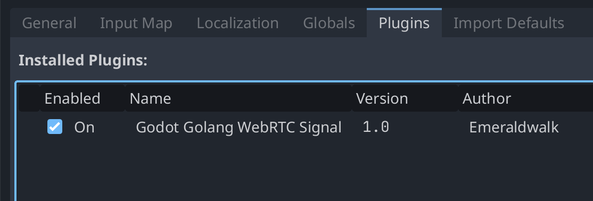
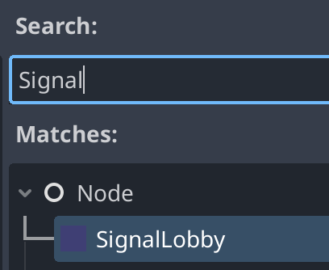

# Golang WebRTC Signaling Server

WebRTC signal server with SSL support written in Go. Supports hosting and joining lobbies. Includes Godot client.

## Project Structure

- /client - Godot client code. Provides a `SignalLobby` node via a Godot plugin.
- /server - Golang signaling server

## Installation

### Client

The client code can be installed as a Godot plugin

1. Copy the `/client` folder to the `/addons` folder in a Godot project
1. Enable the `Godot Golang WebRTC Signal` plugin in the Plugins tab of Project settings

   

1. The plugin provides a `SignalLobby` node that can be added to a scene

   

1. You can connect to the `player_added` and `lobby_sealed` signals:

   ```GDScript
   @onready var signal_lobby = %SignalLobby

   func _ready() -> void:
      signal_lobby.player_added.connect(_on_player_added)
      signal_lobby.lobby_sealed.connect(_on_lobby_sealed)
   ```

## Systemd Config

The server can be configured via systemd on a linux server such as a Raspberry Pi.

1. Open a new config file for the service:

   ```sh
   sudo nano /etc/systemd/system/gowebrtcsignal.service
   ```

1. Copy / paste the following template filling in <USER> and <APPDIR> placeholders

   ```ini
   [Unit]
   Description = Go WebRTC Signaling Server

   [Service]
   Type             = simple
   Restart          = always
   RestartSec       = 5s
   StandardOutput   = append:<APPDIR>/stdout.log
   StandardError    = append:<APPDIR>/stderr.log
   ExecStart        = <APPDIR>/signalserver
   WorkingDirectory = <APPDIR>
   User             = <USER>

   [Install]
   WantedBy = multi-user.target
   ```

1. Enable and start the service

```sh
sudo systemctl enable gowebrtcsignal.service
sudo systemctl start gowebrtcsignal.service
sudo systemctl status gowebrtcsignal.service
```
